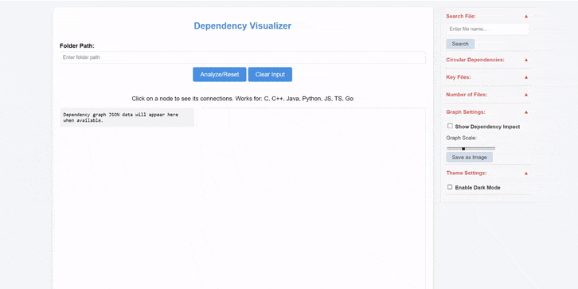

# Dependency-Visualizer

A tool to analyze and visualize dependencies within a specified project folder. This tool is designed to work with various programming languages, including JavaScript, TypeScript, Python, Go, C, C++, and Java. The dependency graph is displayed on a web interface, allowing users to click on nodes to see their dependencies or parent connections.

## Features


- Analyzes dependencies for multiple programming languages.
- Visualizes dependencies in a graph format, with options to pan and zoom.
- Highlights dependencies and parent connections when a node is clicked.

## Supported Languages

- JavaScript (.js)
- TypeScript (.ts)
- Python (.py)
- Go (.go)
- C (.c), C++ (.cpp), and Header Files (.h, .hpp)
- Java (.java)


### Prerequisites

- [Node.js](https://nodejs.org/) (version 14 or later)


## Usage

1. Clone the repository:
   ```bash
   git clone https://github.com/Ernesto-B/Dependency-Visualizer.git
   cd Dependency-Visualizer
   ```
2. Install the dependencies:
   ```bash
   npm install
   ```
3. Start the server:
   ```bash
    node server.js
    ```
    - Default port is `3000`.
4. Open `index.html` in a web browser.
5. Enter the root folder path of the project you want to analyze and click the "Analyze" button.

## Future Improvements
- [ ] Add support for more programming languages.
- [x] Circular dependency detection.
- [x] Improve graph layout and styling.
- [x] Add search functionality to find specific nodes.
- [ ] Add functionality to export the graph as an image.
- [ ] Field for folders to exclude from analysis.
- [ ] Moving nodes by click + drag.
- [ ] Displaying key files all in new lines.
- [ ] Displaying circular dependency files all in new lines.
- [ ] Making each of the control panel's "sections" be a dropdown to be able to hide unwanted controls.
- [ ] Visualization of Dependency Chains: For files with high impact, show the chain of dependencies they influence (e.g., file A → file B → file C), allowing users to trace the flow of impact.
- [ ] Simple animation to show highest impact file.
- [ ] Help/info section explaining features and other important bits (node_modules auto skipped).
- [ ] Clear input field button for root folder path input.
- [ ] Dark mode.
- [ ] Highlight critical paths in the dependency graph (long chains of dependencies that have high impact) to help identify bottlenecks or areas where a single file’s change could cascade across multiple layers.
Use different colors or bold lines to indicate files on the critical path... they may require additional testing or attention during development.
- [ ] Count number of external dependencies for the root folder.
- [ ] Fullscreen graph mode.
- [ ] Docker containerization (to be able to run the tool without having to first start the server, then open the HTML file).